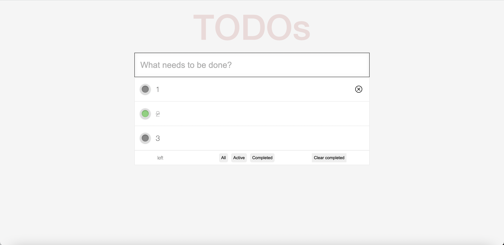

# Web Programming HW#3

# 基本要求(大致上都已完成):
1. 一開始沒有顯示任何Todo Item，等待使用者輸入。
2. 使用者可以在input那邊輸入Todo Item，且按下Enter鍵後會加入到下方的Todo List，狀態為尚未被完成。
3. 點擊checkbox後會變成綠色，且Todo Item會被加上line-through以及0.5 opacity的樣式。
4. 顯示「未完成」Todo Item 數量的功能仍在努力中。

# 10/13更新：
・學會由上往下傳入state以及useState，下層再定義useState，且state會自動回傳正確的變數。
・./Components/TodoList 最後沒有用到，其實我現在應該可以把它改成component（使用第一個新知），但懶得改。
・Hooks也可以用useRef取reference。
